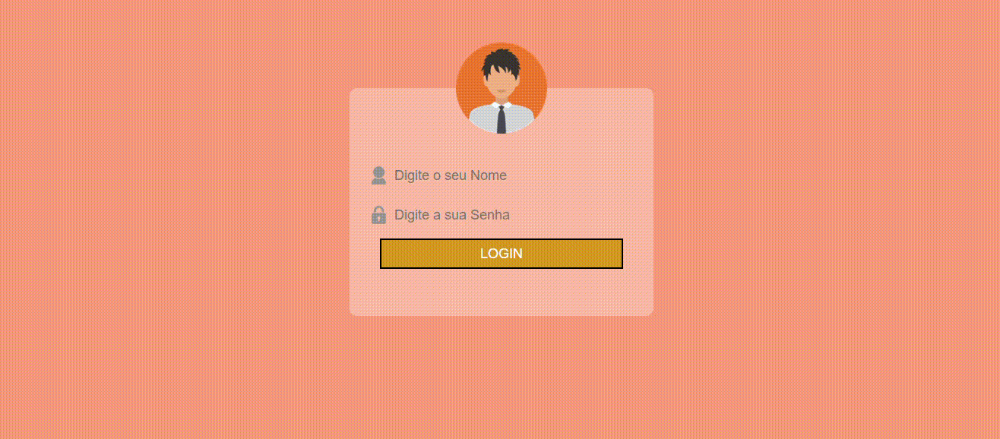

# Página de Login Simples

   
### Elementos básicos do HTML e CSS foram utilizado, como: Input,Img,Div,text-decoration, -webkit-border-radius e outros.

### <strong>GIF :</strong>

## KaueNunez - 18/11/2023